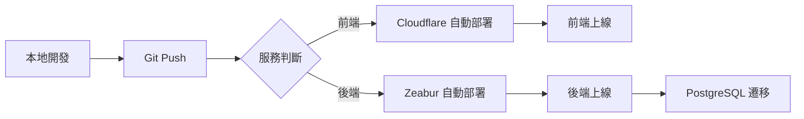

# AI App Share - 單頁 HTML App 快速分享平台 - 技術架構方案

## 選定技術棧（Zeabur + Cloudflare + Tebi）

```
┌─────────────────────────────────────────────────────────┐
│                    使用者瀏覽器                          │
└─────────────────────────────────────────────────────────┘
                          │
                          ▼
┌─────────────────────────────────────────────────────────┐
│          Cloudflare Pages (前端 CDN)                    │
│  - Next.js 14+ SSG/SSR                                  │
│  - 無限頻寬                                             │
│  - 全球 CDN                                             │
└─────────────────────────────────────────────────────────┘
                          │
                          ▼
┌─────────────────────────────────────────────────────────┐
│          Zeabur (後端 API + 資料庫)                      │
│  - Node.js/Express API                                  │
│  - PostgreSQL 資料庫                                    │
│  - 認證服務                                             │
│  - $5/月免費額度                                        │
└─────────────────────────────────────────────────────────┘
                          │
                          ▼
┌─────────────────────────────────────────────────────────┐
│          Tebi S3 (檔案儲存)                             │
│  - HTML/CSS/JS 檔案                                     │
│  - 縮圖圖片                                             │
│  - 25GB 免費儲存                                        │
│  - 250GB 免費流量/月                                     │
└─────────────────────────────────────────────────────────┘
```

---

## 各服務詳細規格

### 1. Cloudflare Pages (前端部署)

#### 免費額度
- ✅ **無限頻寬** (最大優勢！)
- ✅ 500 次 builds/月
- ✅ 全球 300+ 邊緣節點
- ✅ 自動 SSL 證書
- ✅ 自動 HTTPS 重定向
- ✅ 支援自訂域名

#### 支援框架
- Next.js (透過 @opennextjs/cloudflare)
- React
- Vue
- Svelte
- 靜態 HTML

#### 部署方式
```bash
# 方法 1: Git 整合（推薦）
連接 GitHub → 自動部署

# 方法 2: CLI 部署
npm install -g wrangler
wrangler pages deploy ./out
```

#### Next.js 配置
```javascript
// next.config.js
module.exports = {
  output: 'export', // 靜態匯出
  images: {
    unoptimized: true, // Cloudflare 不支援 Image Optimization
  },
  trailingSlash: true,
}
```

---

### 2. Zeabur (後端部署)

#### 免費額度（Free Trial）
- 💰 **$5/月 額度**
- 🔧 最高 1 vCPU + 2GB RAM/服務
- 📦 無限服務數量
- 🌐 社群支援
- 🔄 自動部署

#### 計費說明
- **前 $5 免費**，超過才計費
- 依實際使用量計費（按秒）
- 範例：5 個小專案（各 100MB RAM）≈ $5/月

#### 支援服務
- Node.js / Express
- PostgreSQL / MySQL
- Redis
- Python / Go / Rust
- Docker 容器

#### 部署方式
```bash
# 1. 安裝 CLI
npm install -g @zeabur/cli

# 2. 登入
zeabur auth login

# 3. 部署
zeabur deploy
```

#### 一鍵部署模板
Zeabur Marketplace 提供預設模板：
- Express + PostgreSQL
- Next.js Fullstack
- Strapi CMS
- Ghost Blog

---

### 3. Tebi S3 (檔案儲存)

#### 永久免費額度
- 💾 **25GB 儲存空間**
- 📤 **250GB 流量/月**
- 🔄 2 份資料備份
- 🌍 歐洲資料中心（GDPR 合規）
- 🆓 API 呼叫免費

#### 14 天試用
- 2TB 儲存
- 8TB 流量
- 無需信用卡

#### 超額計費
| 項目 | 價格 |
|------|------|
| 額外儲存 | $0.02/GB/月 |
| 額外流量 | $0.01/GB |
| API 呼叫 | 免費 |

#### S3 相容性
完全相容 AWS S3 API：
- PUT / GET / DELETE
- Bucket 管理
- ACL 權限控制
- CORS 設定

#### SDK 範例
```javascript
// Node.js with AWS SDK v3
import { S3Client, PutObjectCommand } from '@aws-sdk/client-s3'

const s3 = new S3Client({
  region: 'auto',
  endpoint: 'https://s3.tebi.io',
  credentials: {
    accessKeyId: process.env.TEBI_ACCESS_KEY,
    secretAccessKey: process.env.TEBI_SECRET_KEY,
  },
})

// 上傳檔案
await s3.send(new PutObjectCommand({
  Bucket: 'ai-app-share',
  Key: 'apps/app-123.html',
  Body: htmlContent,
  ContentType: 'text/html',
  ACL: 'public-read',
}))

// 檔案 URL
const fileUrl = `https://s3.tebi.io/ai-app-share/apps/app-123.html`
```

---

## 完整架構設計

### 前端 (Cloudflare Pages)

#### 技術棧
- **框架**: Next.js 14 (App Router)
- **UI**: TailwindCSS + shadcn/ui
- **狀態管理**: Zustand
- **表單**: React Hook Form + Zod
- **編輯器**: Monaco Editor
- **HTTP 客戶端**: Axios / Fetch

#### 目錄結構
```
cloudflare-frontend/
├── src/
│   ├── app/
│   │   ├── page.tsx              # 首頁
│   │   ├── explore/
│   │   ├── app/[id]/
│   │   ├── create/
│   │   └── profile/[username]/
│   ├── components/
│   │   ├── ui/                   # shadcn/ui
│   │   ├── AppCard.tsx
│   │   ├── AppEditor.tsx
│   │   └── AppPreview.tsx
│   ├── lib/
│   │   ├── api.ts                # API 客戶端
│   │   └── utils.ts
│   └── styles/
├── public/
├── next.config.js
└── package.json
```

---

### 後端 (Zeabur)

#### 技術棧
- **框架**: Express.js + TypeScript
- **ORM**: Prisma
- **資料庫**: PostgreSQL 15
- **認證**: JWT + bcrypt
- **驗證**: Zod
- **檔案上傳**: multer → Tebi S3

#### 目錄結構
```
zeabur-backend/
├── src/
│   ├── routes/
│   │   ├── auth.ts               # 認證路由
│   │   ├── apps.ts               # APP CRUD
│   │   ├── users.ts
│   │   ├── ratings.ts
│   │   └── comments.ts
│   ├── middleware/
│   │   ├── auth.ts               # JWT 驗證
│   │   ├── upload.ts             # 檔案上傳
│   │   └── validation.ts
│   ├── services/
│   │   ├── s3.service.ts         # Tebi S3 操作
│   │   ├── app.service.ts
│   │   └── user.service.ts
│   ├── prisma/
│   │   ├── schema.prisma
│   │   └── migrations/
│   ├── utils/
│   └── index.ts
├── .env
├── Dockerfile                     # Zeabur 部署
├── zeabur.yaml
└── package.json
```

#### Zeabur 配置檔
```yaml
# zeabur.yaml
name: ai-app-share-backend
services:
  - name: api
    type: nodejs
    buildCommand: npm run build
    startCommand: npm start
    env:
      - DATABASE_URL=${DATABASE_URL}
      - JWT_SECRET=${JWT_SECRET}
      - TEBI_ACCESS_KEY=${TEBI_ACCESS_KEY}
      - TEBI_SECRET_KEY=${TEBI_SECRET_KEY}

  - name: postgres
    type: postgresql
    plan: free
```

---

## 資料庫設計 (PostgreSQL on Zeabur)

### Schema
```sql
-- Users
CREATE TABLE users (
  id UUID PRIMARY KEY DEFAULT gen_random_uuid(),
  email VARCHAR(255) UNIQUE NOT NULL,
  username VARCHAR(50) UNIQUE NOT NULL,
  password_hash VARCHAR(255) NOT NULL,
  avatar_url TEXT,
  bio TEXT,
  created_at TIMESTAMP DEFAULT NOW(),
  updated_at TIMESTAMP DEFAULT NOW()
);

-- Apps
CREATE TABLE apps (
  id UUID PRIMARY KEY DEFAULT gen_random_uuid(),
  user_id UUID REFERENCES users(id) ON DELETE CASCADE,
  title VARCHAR(255) NOT NULL,
  description TEXT,
  category VARCHAR(50),
  tags TEXT[],

  -- S3 儲存路徑
  html_s3_key TEXT NOT NULL,        -- e.g., "apps/uuid/index.html"
  thumbnail_s3_key TEXT,             -- e.g., "thumbnails/uuid.png"

  -- 元數據
  is_public BOOLEAN DEFAULT true,
  view_count INTEGER DEFAULT 0,
  like_count INTEGER DEFAULT 0,

  created_at TIMESTAMP DEFAULT NOW(),
  updated_at TIMESTAMP DEFAULT NOW()
);

CREATE INDEX idx_apps_user_id ON apps(user_id);
CREATE INDEX idx_apps_category ON apps(category);
CREATE INDEX idx_apps_created_at ON apps(created_at DESC);

-- Ratings
CREATE TABLE ratings (
  id UUID PRIMARY KEY DEFAULT gen_random_uuid(),
  app_id UUID REFERENCES apps(id) ON DELETE CASCADE,
  user_id UUID REFERENCES users(id) ON DELETE CASCADE,
  rating INTEGER CHECK (rating >= 1 AND rating <= 5),
  created_at TIMESTAMP DEFAULT NOW(),
  UNIQUE(app_id, user_id)
);

-- Comments
CREATE TABLE comments (
  id UUID PRIMARY KEY DEFAULT gen_random_uuid(),
  app_id UUID REFERENCES apps(id) ON DELETE CASCADE,
  user_id UUID REFERENCES users(id) ON DELETE CASCADE,
  content TEXT NOT NULL,
  created_at TIMESTAMP DEFAULT NOW(),
  updated_at TIMESTAMP DEFAULT NOW()
);

-- Favorites
CREATE TABLE favorites (
  id UUID PRIMARY KEY DEFAULT gen_random_uuid(),
  app_id UUID REFERENCES apps(id) ON DELETE CASCADE,
  user_id UUID REFERENCES users(id) ON DELETE CASCADE,
  created_at TIMESTAMP DEFAULT NOW(),
  UNIQUE(app_id, user_id)
);
```

---

## 檔案儲存策略 (Tebi S3)

### Bucket 結構
```
ai-app-share/
├── apps/
│   ├── {uuid}/
│   │   ├── index.html          # 主檔案
│   │   ├── style.css           # (可選)
│   │   └── script.js           # (可選)
├── thumbnails/
│   ├── {uuid}.png              # 縮圖
└── avatars/
    └── {user-uuid}.jpg         # 使用者頭像
```

### URL 範例
```
HTML 檔案: https://s3.tebi.io/ai-app-share/apps/{uuid}/index.html
縮圖: https://s3.tebi.io/ai-app-share/thumbnails/{uuid}.png
```

### CORS 設定
```json
{
  "CORSRules": [
    {
      "AllowedOrigins": ["https://your-domain.pages.dev"],
      "AllowedMethods": ["GET", "HEAD"],
      "AllowedHeaders": ["*"]
    }
  ]
}
```

---

## API 設計

### RESTful Endpoints

#### 認證
```
POST   /api/auth/register       # 註冊
POST   /api/auth/login          # 登入
POST   /api/auth/logout         # 登出
GET    /api/auth/me             # 獲取當前使用者
```

#### APP 管理
```
GET    /api/apps                # 列表（支援分頁、篩選）
GET    /api/apps/:id            # 詳情
POST   /api/apps                # 創建（上傳到 S3）
PUT    /api/apps/:id            # 更新
DELETE /api/apps/:id            # 刪除（同時刪除 S3 檔案）
GET    /api/apps/:id/preview    # 預覽 URL
```

#### 互動
```
POST   /api/apps/:id/rate       # 評分
POST   /api/apps/:id/comment    # 評論
POST   /api/apps/:id/favorite   # 收藏
DELETE /api/apps/:id/favorite   # 取消收藏
```

#### 使用者
```
GET    /api/users/:username     # 使用者資料
GET    /api/users/:username/apps # 使用者的 APP
```

---

## 部署流程

### 1. 前端部署 (Cloudflare Pages)

```bash
# 1. 建構專案
npm run build

# 2. 連接 GitHub（自動部署）
# 在 Cloudflare Dashboard 設定

# 或使用 Wrangler CLI
npx wrangler pages deploy ./out
```

**環境變數**:
```
NEXT_PUBLIC_API_URL=https://your-app.zeabur.app
```

---

### 2. 後端部署 (Zeabur)

```bash
# 方法 1: GitHub 整合（推薦）
1. 連接 GitHub 倉庫
2. Zeabur 自動偵測並部署

# 方法 2: CLI 部署
zeabur deploy
```

**環境變數**:
```bash
DATABASE_URL=postgresql://...        # Zeabur 自動提供
JWT_SECRET=your-secret-key
TEBI_ACCESS_KEY=your-access-key
TEBI_SECRET_KEY=your-secret-key
TEBI_BUCKET=ai-app-share
TEBI_ENDPOINT=https://s3.tebi.io
FRONTEND_URL=https://your-app.pages.dev
```

---

### 3. 資料庫部署 (PostgreSQL on Zeabur)

```bash
# 1. 在 Zeabur Dashboard 新增 PostgreSQL 服務
# 2. 連接到 API 服務（自動注入 DATABASE_URL）

# 3. 執行遷移
npx prisma migrate deploy
```

---

### 4. 設定 Tebi S3

```bash
# 1. 註冊 Tebi 帳號
# 2. 創建 Bucket: ai-app-share
# 3. 設定 Public Read 權限
# 4. 設定 CORS

# 5. 獲取 Access Key 和 Secret Key
# 加入 Zeabur 環境變數
```

---

## 成本估算

### 免費額度足夠嗎？

#### 小型專案 (0-1000 使用者)
| 服務 | 使用量 | 成本 |
|------|--------|------|
| Cloudflare Pages | 100K 訪問/月 | **$0** |
| Zeabur | 1 API (512MB RAM) + 1 DB | **$0** (在 $5 額度內) |
| Tebi S3 | 10GB 儲存 + 100GB 流量 | **$0** |
| **總計** | | **$0/月** ✅ |

#### 中型專案 (1000-10000 使用者)
| 服務 | 使用量 | 成本 |
|------|--------|------|
| Cloudflare Pages | 1M 訪問/月 | **$0** |
| Zeabur | API (1GB RAM) + DB | **~$8-10/月** |
| Tebi S3 | 50GB 儲存 + 500GB 流量 | **~$5-7/月** |
| **總計** | | **~$13-17/月** |

#### 大型專案 (10000+ 使用者)
考慮升級到：
- Zeabur Team Plan ($80/月)
- Tebi 更高儲存方案
- Cloudflare Pro (可選)

---

## 優勢分析

### ✅ 這個組合的優點

1. **完全免費起步**
   - 前期 $0 成本
   - 適合 MVP 和測試

2. **無限前端流量**
   - Cloudflare 無頻寬限制
   - 全球 CDN 加速

3. **S3 相容**
   - Tebi 完全相容 AWS S3
   - 未來可輕鬆遷移

4. **簡單部署**
   - Zeabur 一鍵部署
   - GitHub 自動同步

5. **可擴展性**
   - 隨需付費
   - 平滑升級

### ⚠️ 需要注意

1. **Zeabur 免費額度有限**
   - 超過 $5/月 需付費
   - 建議監控用量

2. **Tebi 流量限制**
   - 免費 250GB/月
   - 超過 $0.01/GB

3. **Cloudflare Pages 限制**
   - Next.js Image Optimization 不支援
   - 需使用 `output: 'export'`

---

## 開發工作流程



---

## 安全建議

### 1. 環境變數管理
```bash
# 前端 (.env.local)
NEXT_PUBLIC_API_URL=https://api.your-domain.com

# 後端 (Zeabur Dashboard)
DATABASE_URL=postgresql://...
JWT_SECRET=strong-random-string-here
TEBI_ACCESS_KEY=***
TEBI_SECRET_KEY=***
```

### 2. S3 權限控制
```javascript
// 公開讀取，私有寫入
ACL: 'public-read'

// 使用簽名 URL 上傳（更安全）
const signedUrl = await s3.getSignedUrlPromise('putObject', {
  Bucket: 'ai-app-share',
  Key: `apps/${uuid}/index.html`,
  Expires: 3600, // 1 小時有效
})
```

### 3. HTML Sanitization
```javascript
import DOMPurify from 'isomorphic-dompurify'

// 清理使用者上傳的 HTML
const cleanHtml = DOMPurify.sanitize(userHtml, {
  ALLOWED_TAGS: ['div', 'span', 'p', 'h1', 'h2', 'button'],
  ALLOWED_ATTR: ['class', 'id', 'style'],
})
```

### 4. Rate Limiting
```javascript
import rateLimit from 'express-rate-limit'

const limiter = rateLimit({
  windowMs: 15 * 60 * 1000, // 15 分鐘
  max: 100, // 最多 100 個請求
})

app.use('/api/', limiter)
```

---

## 監控與分析

### Cloudflare Web Analytics
```html
<!-- 免費，隱私友好 -->
<script defer src='https://static.cloudflareinsights.com/beacon.min.js'
        data-cf-beacon='{"token": "your-token"}'></script>
```

### Zeabur Logs
```bash
# 查看即時日誌
zeabur logs -f

# 查看歷史日誌
zeabur logs --tail 100
```

---

## 下一步

準備開始實施了嗎？我可以幫你：

1. **初始化專案** - 建立前後端架構
2. **設定環境** - Zeabur、Tebi、Cloudflare 設定
3. **實作核心功能** - 認證、上傳、瀏覽
4. **部署上線** - 完整部署流程

你想從哪裡開始？
